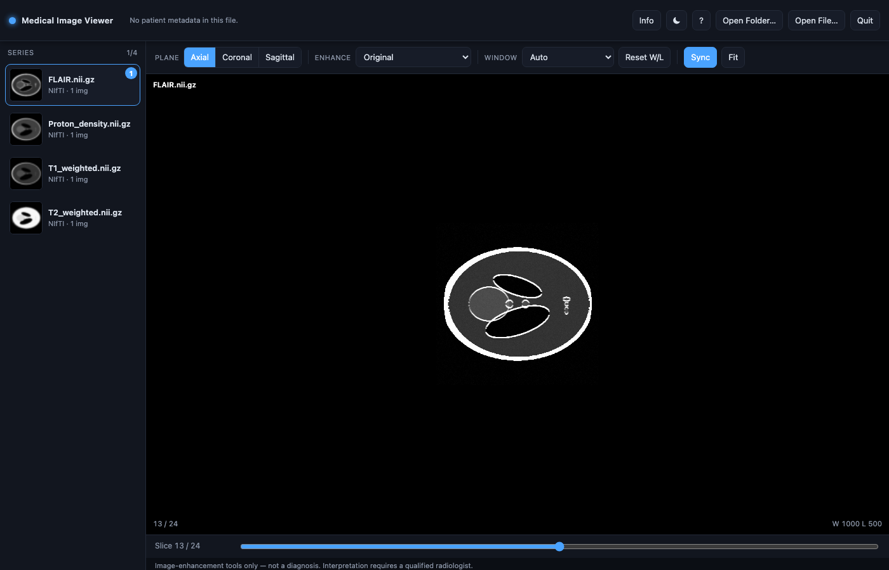
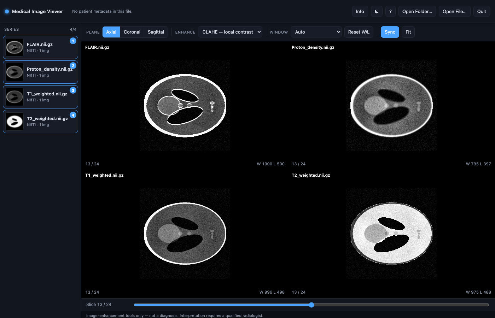

# Medical Image Viewer

A lightweight, self-hosted viewer for **MRI, CT, and other medical scans** in
**DICOM** and **NIfTI** formats. It runs entirely on your own machine and ships
with two interfaces:

- **Web app** *(recommended)* — a clean, radiology-workstation-style UI that
  runs in your browser: patient banner, series thumbnails, multi-panel compare,
  window/level, zoom/pan, and on-the-fly image enhancement.
- **Desktop window** — a dependency-light single-window viewer built on
  matplotlib, for when you just want to open a scan quickly.

> ⚠️ **Medical disclaimer**
> This is an **image-viewing and image-enhancement** tool for education,
> research, and personal use. It is **not a medical device** and must **not** be
> used for diagnosis or treatment decisions. Enhancement filters (contrast,
> edges, "highlight fluid", etc.) change how an image *looks* — they do not
> detect, confirm, or rule out any condition. Only a qualified radiologist can
> interpret an MRI or CT scan. Always consult a healthcare professional.

---

## Supported scans

| Modality | Support |
|----------|---------|
| **MRI** | Full support — all sequences (T1, T2, PD, fat-sat, etc.). |
| **CT** | Full support — pixel values are automatically converted to **Hounsfield Units** (via the DICOM rescale slope/intercept), and standard CT windows (Brain, Lung, Bone…) are built in. |
| **PET / other DICOM image types** | Loaded and displayed like any other image series. |

**File formats:** DICOM (`.dcm` — a single file, one series folder, or a whole
study with nested sub-folders) and NIfTI (`.nii`, `.nii.gz`, 3D or 4D).

When you open a study folder, every series inside is discovered automatically
and listed with its description and image count. Non-image objects (e.g.
structured-report "series") are shown but marked and not opened.

---

## Quick start (no terminal needed)

For non-technical users — **just double-click a file**. The first launch sets
everything up automatically (it creates a private Python environment and
installs the required packages, which can take a few minutes); later launches
open in seconds.

| Your computer | Double-click | Notes |
|---------------|--------------|-------|
| **macOS** | `start.command` | If macOS blocks it the first time, **right-click → Open → Open**. |
| **Windows** | `start.vbs` | Cleanest — no black window. First run shows a setup window. |
| **Windows** (alternative) | `start.bat` | Same thing, but keeps a console window open. |

Your web browser opens automatically at **http://127.0.0.1:5001**. To stop the
viewer, click **Quit** in the app (top-right), or close the launcher window.

**Requirement:** Python 3.10+ must be installed
([python.org/downloads](https://www.python.org/downloads/) — on Windows, tick
*"Add python.exe to PATH"* during install). The launchers check for it and tell
you if it's missing. Everything else installs itself.

> On macOS, if you downloaded the project as a ZIP, the launcher may lose its
> "executable" flag. Fix it once by opening Terminal in the project folder and
> running `chmod +x start.command`, or use the manual steps below.

---

## Screenshots

*(Shown with the synthetic [Shepp–Logan phantom](https://en.wikipedia.org/wiki/Shepp%E2%80%93Logan_phantom) — no real patient data.)*

Single-series view:



Synced 4-panel comparison with CLAHE (local-contrast) enhancement:



---

## Features

- **MRI, CT, PET** in DICOM and NIfTI (see [Supported scans](#supported-scans)).
- **Automatic series discovery** across a whole study folder.
- **Three planes:** axial, coronal, sagittal — with correct anatomical
  proportions derived from voxel spacing.
- **Multi-panel compare:** view up to **4 series at once** with **synchronized
  scrolling** (aligned by relative slice position).
- **Window / level** (contrast & brightness) by dragging, plus one-click
  presets including standard **CT Hounsfield windows** — see
  [Window / level presets](#window--level-presets).
- **Zoom & pan**, per-panel, with double-click reset.
- **Enhancement filters** to make features easier to see — see
  [Enhancement filters](#enhancement-filters).
- **Patient / study info** read from DICOM headers, with a one-click privacy
  toggle to hide it.
- **Dark / light theme** and full **keyboard shortcuts**.
- **100% local:** the web app binds to `127.0.0.1` only; no data leaves your
  machine, no cloud, no external services.

---

## Enhancement filters

These are display aids — they change how a slice *looks* to make certain
features easier to see. **They do not diagnose anything** (see the disclaimer).
Select one from the **Enhance** menu (or press `1`–`7`).

| Filter | What it does | When it helps |
|--------|--------------|---------------|
| **Original** | No processing — the raw image with your window/level. | Default, always start here. |
| **Invert** | Swaps dark and light (photo-negative). | Some structures stand out better as dark-on-light. |
| **CLAHE** *(local contrast)* | Contrast-Limited Adaptive Histogram Equalization — boosts contrast *locally*, region by region, so faint differences between nearby tissues become visible. | Bringing out subtle soft-tissue detail; the most generally useful enhancement. |
| **Sharpen** | Unsharp mask — crisps up edges and fine structure. | Making borders and small structures clearer. |
| **Denoise** | Light Gaussian smoothing to reduce grainy noise. | Noisy or low-signal images. |
| **Edges** | Sobel edge map (colored) — highlights boundaries and interfaces. | Seeing outlines, cortical margins, tissue interfaces. |
| **Highlight fluid** | Tints **bright signal orange** over the grayscale. On fluid-sensitive **MRI** (fat-suppressed PD/T2), fluid/edema/effusion is bright — this draws the eye to it. | Fluid-sensitive MRI. *Not meaningful for CT* — use CT windows instead. |

> Note: enhancement is computed per slice, so with several panels open, fast
> scrolling under a heavy filter (e.g. CLAHE) can feel slightly slower.

---

## Window / level presets

"Window/level" controls brightness and contrast: **level** is the center
intensity and **width** is the range shown. Drag on any panel to adjust it
manually, or pick a preset from the **Window** menu.

**General presets** (work on any scan): Auto (default), Brighter, Darker,
High contrast, Low contrast.

**CT presets** apply the standard **Hounsfield Unit** windows radiologists use.
They are absolute values, so they only make sense on CT (which is calibrated in
HU):

| Preset | Level / Width (HU) | Typical use |
|--------|--------------------|-------------|
| CT · Brain | 40 / 80 | Brain parenchyma |
| CT · Soft tissue | 40 / 400 | General soft tissue |
| CT · Abdomen | 50 / 350 | Abdominal organs |
| CT · Lung | −600 / 1500 | Lungs and airways |
| CT · Bone | 400 / 1800 | Bone detail |
| CT · Angio | 100 / 700 | Contrast-enhanced vessels |

---

## Requirements

- **Python 3.10+**
- Works on **macOS, Windows, and Linux**.
- Native "Open Folder / Open File" dialogs are supported on all three (macOS
  uses `osascript`, Windows uses PowerShell, Linux uses `zenity`/`kdialog`). If
  no dialog tool is available on Linux, just pass the scan path on the command
  line.

Python packages: `numpy`, `pydicom`, `nibabel`, `scipy`, `scikit-image`,
`pillow`, `flask` (web app) and `matplotlib` (desktop viewer). All are installed
automatically by the launchers or via `requirements.txt`.

---

## Manual installation (advanced / from a terminal)

```bash
git clone <your-repo-url>
cd medical-image-viewer

python3 -m venv .venv
source .venv/bin/activate          # Windows: .venv\Scripts\activate
pip install -r requirements.txt
```

---

## Usage (from a terminal)

### Web app (recommended)

```bash
python app.py /path/to/study_folder     # a study folder, series folder, or file
python app.py                           # or launch empty and use "Open Folder…"
```

Your browser opens automatically at **http://127.0.0.1:5001**. Stop it with the
in-app **Quit** button or `Ctrl+C`.

**Workflow:** pick a study → click a series in the sidebar to view it → click up
to four series to compare them side by side → scroll through slices (all panels
stay in sync) → switch plane, apply an enhancement, or drag to adjust contrast.

### Desktop window

```bash
python desktop_viewer.py                    # opens the window, then use Open…
python desktop_viewer.py scan.nii.gz        # a NIfTI file
python desktop_viewer.py /path/to/series/   # one DICOM series
python desktop_viewer.py /path/to/study/    # a study; pick series in-window
```

The terminal will look idle while the window is open — that's expected. Close
the window (don't `Ctrl+C`) to return to the prompt.

---

## Controls

| Action | Web app | Desktop |
|--------|---------|---------|
| Move through slices | Scroll · `↑`/`↓` · slider | Scroll · `↑`/`↓` · slider |
| Change plane | Toolbar · `A` / `C` / `S` | Buttons · `A` / `C` / `S` |
| Enhancement filter | Menu · `1`–`7` | Radio list |
| Window / level | Left-drag on a panel | Right-drag on a panel |
| Reset window / level | `R` · Reset W/L | `R` · Reset contrast |
| Zoom | `Ctrl`/`Cmd` + scroll | — |
| Pan | `Shift` + drag | — |
| Reset zoom / pan | `F` · Fit | — |
| Reset a single panel | Double-click | — |
| Toggle patient info | `I` · Info | Info button |
| Toggle dark/light theme | `D` · ☾/☀ | Dark button |
| Shortcut help | `?` | — |
| Stop the viewer | Quit button | Close the window |

---

## How it works

```
app.py            Flask backend: serves the UI and renders slices to PNG on request
viewer_core.py    Data + rendering core (no GUI): loading, series discovery,
                  patient metadata, window/level, and enhancement filters
templates/
  index.html      Self-contained web UI (HTML + CSS + JS, no external assets)
desktop_viewer.py Standalone desktop viewer (matplotlib)
```

The web frontend requests one slice at a time from the backend
(`/api/series/<i>/slice?plane=…&index=…&filter=…&level=…&width=…`); the backend
loads and caches each volume, applies the window/level and filter with NumPy /
scikit-image, and returns a PNG. CT volumes are converted to Hounsfield Units on
load. Volumes are cached in memory per session.

---

## Privacy & security

- The web app listens on **`127.0.0.1` (localhost) only** — it is not reachable
  from your network by default. **Do not** expose it to the internet or bind it
  to `0.0.0.0`; it has no authentication and is intended for single-user local
  use.
- Scans and patient metadata are read from local disk and never uploaded.
- Use the **Info** toggle to hide patient identifiers before screen-sharing or
  taking screenshots. If you plan to share images or example data, **anonymize
  the DICOM files first** (patient name, ID, dates, etc.).

---

## Limitations

- Panels in compare mode are aligned by **relative slice position**, not by full
  3D spatial co-registration. For same-session series of the same region this
  keeps them well aligned, but it is not voxel-accurate registration across
  differing orientations.
- Enhancement filters are display aids only (see the disclaimer).
- "Highlight fluid" is designed for fluid-sensitive MRI and is not meaningful on
  CT — use the CT windows instead.

---

## Contributing

Issues and pull requests are welcome. Ideas that fit well: distance/ROI
measurement tools, synchronized crosshairs across panels, MIP/thick-slab
rendering, additional file formats, and DICOM anonymization helpers.

---

## License

Released under the [MIT License](LICENSE). You are free to use, modify, and
distribute this software; it comes with no warranty (see the disclaimer above —
it is not a medical device).

---

## Acknowledgements

Built with [pydicom](https://pydicom.github.io/),
[NiBabel](https://nipy.org/nibabel/),
[scikit-image](https://scikit-image.org/),
[NumPy](https://numpy.org/), [Flask](https://flask.palletsprojects.com/), and
[matplotlib](https://matplotlib.org/).
